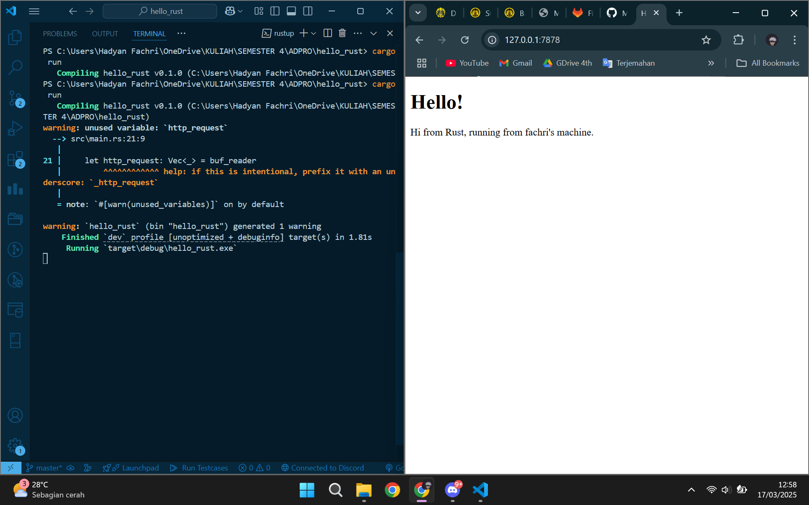
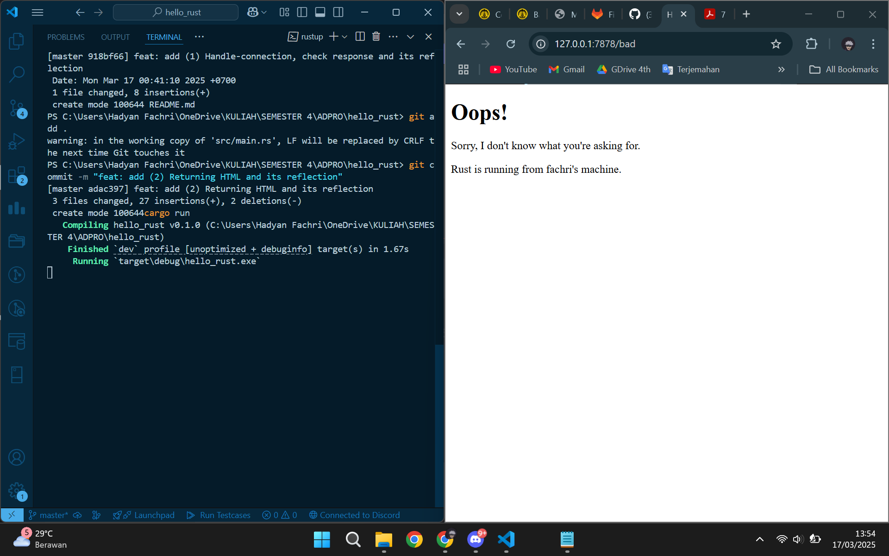

# Concurrency
Nama: Hadyan Fachri\
Kelas: Advprog A\
NPM: 2306245030\

## Commit 1 Reflection Notes
*Milestone 1: Single threaded web server*
Pada milestone pertama, saya mengembangkan web server dengan menambahkan fungsi `handle_connection()` agar bisa membaca dan mencetak permintaan HTTP dari klien. Dengan `BufReader`, server dapat membaca setiap baris request, menyimpannya dalam `Vec<String>`, lalu menampilkannya di terminal. Fungsi ini memastikan hanya bagian header request yang diambil dengan `.take_while(|line| !line.is_empty())`, sehingga bisa melihat detail seperti metode HTTP, path, dan user-agent. Saat dijalankan dengan `cargo run` dan diakses melalui browser, server akan mencetak daftar header request yang masuk, menandakan bahwa koneksi berhasil diterima dan diproses.

## Commit 2 Reflection
*Milestone 2: Returning HTML*
Pada milestone kedua, saya meningkatkan fungsionalitas web server dengan memungkinkan server mengirimkan file HTML sebagai respons terhadap permintaan HTTP. Sebelumnya, server hanya mencetak request yang diterima ke terminal, tetapi sekarang perlu mengimplementasikan fungsi `handle_connection()` yang membaca file HTML (`hello.html`), lalu mengirimkannya ke klien dengan format HTTP yang sesuai. Dengan menggunakan `fs::read_to_string()` yang dapat membaca konten file, lalu menyusunnya menjadi respons lengkap dengan status `HTTP/1.1 200 OK` dan header `Content-Length`. Hasilnya, saat mengakses **http://127.0.0.1:7878** melalui browser akan melihat halaman HTML yang telah kita buat. Perubahan ini memberikan dasar bagi server untuk menangani berbagai jenis permintaan dan meresponsnya dengan konten yang lebih kompleks di tahap berikutnya.

## Commit 3 Reflection
*Milestone 3: Validating request and selectively responding* 
Pada milestone ketiga, kita meningkatkan server dengan menambahkan **validasi request** dan **penanganan respons yang berbeda** berdasarkan path yang diminta. Dengan menggunakan `BufReader`, kita membaca baris pertama request (`request_line`) untuk mengetahui **path yang diminta oleh klien**. Jika permintaan adalah `"GET / HTTP/1.1"`, server akan merespons dengan file **hello.html** dan status `"HTTP/1.1 200 OK"`. Jika path yang diminta berbeda, server akan mengembalikan **404 Page.html** dengan status `"HTTP/1.1 404 NOT FOUND"`.

Dengan pendekatan ini, server kini dapat membedakan antara request yang valid dan yang tidak ditemukan, seperti server web nyata yang menampilkan **halaman utama** atau **halaman error 404** jika pengguna mencoba mengakses path yang tidak tersedia. Hal ini menjadi dasar bagi penanganan request yang lebih kompleks di milestone berikutnya.

## Commit 4 Reflection
*Milestone 4: Simulation slow response* 
Pada milestone keempat, saya mensimulasikan **respon server yang lambat** untuk memahami bagaimana server single-threaded menangani permintaan secara berurutan. Dengan menambahkan **path `/sleep`**, perlu menggunakan `thread::sleep(Duration::from_secs(10))` untuk membuat server **menunda respons selama 10 detik** sebelum mengirimkan halaman HTML. Ketika satu permintaan `/sleep` sedang diproses, permintaan lain (misalnya akses ke `/`) akan tertunda hingga proses sebelumnya selesai.

Ini menunjukkan **keterbatasan server single-threaded**, di mana satu permintaan yang lama dapat memblokir permintaan lainnya. Jika dua tab browser mencoba mengakses server secara bersamaan—satu menuju `/sleep` dan satu ke `/`—maka permintaan ke `/` juga akan tertunda hingga proses `/sleep` selesai. Terbukti bahwa pendekatan **single-threaded tidak efisien untuk menangani banyak request secara bersamaan**, sehingga di milestone berikutnya kita akan beralih ke **multi-threading** untuk meningkatkan performa server.